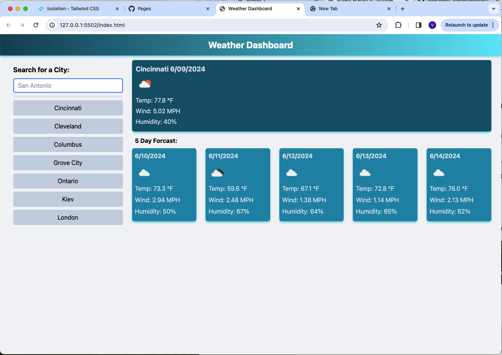

# Weather Dashboard

This Weather Dashboard allows users to search for weather forecasts by city and view the current and 5-day forecast. It also saves search history and allows users to quickly access previously searched cities.

## Table of Contents

- [Demo](#demo)
- [Features](#features)
- [Technologies Used](#technologies-used)
- [Setup](#setup)
- [Usage](#usage)
- [License](#license)

## Demo

- **GitHub Repository:** [Weather Dashboard](https://github.com/valyastriz/Weather_Dashboard)
- **Deployed Site:** [Weather Dashboard Demo](https://valyastriz.github.io/Weather_Dashboard/)

## Features

- Search for weather by city
- View current weather and 5-day forecast
- Save search history
- Access previously searched cities by clicking on previous searches - duplicate searches will not show as duplicates in the saved searches.
- Data persistence using localStorage

## Technologies Used

- HTML
- CSS (TailwindCSS)
- JavaScript
- OpenWeatherMap API
- Tailwind

## Screenshot



## Setup

1. **Clone the repository:**

   ```bash
   git clone https://github.com/valyastriz/Weather_Dashboard.git
   cd Weather_Dashboard

3. **Open index.html in your browser:**

    Simply open the `index.html` file in your preferred web browser to view the Weather Dashboard locally.

## Usage

1. **Search for a city:**
    
    Enter the name of a city in the input field and press Enter to search.

2. **View weather data:**

    The dashboard will display the current weather and a 5-day forecast for the searched city.

3. **Save and access previous searches:**

    Your search history will be saved in the sidebar. Click on a previously searched city to quickly access its weather data.

## Acknowledgements

    This README was created in collaboration with ChatGPT.